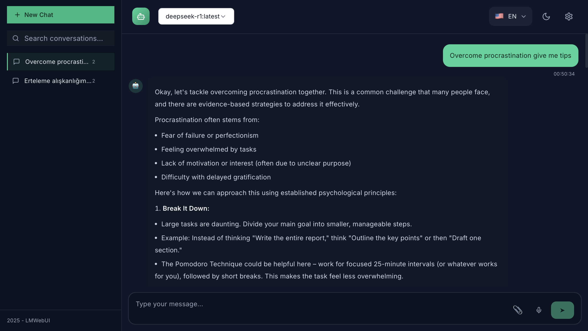

# LMWebUI

<div align="center">
  
  <p><em>LMWebUI - Modern Language Model Web UI with dark theme and ChatGPT-like interface</em></p>
</div>

<div align="center">
  
  
  
  
</div>

<div align="center">
  <h3>🚀 Modern Language Model Web UI for local Ollama models</h3>
  <p>Open-source, privacy-focused, and fully customizable AI chat interface</p>
  <p><strong>🌐 Website:</strong> <a href="https://lmwebui.com">lmwebui.com</a></p>
</div>

---

## 📘 About LMWebUI

**LMWebUI** is an open-source web interface that enables users to interact with local language models through a modern, privacy-focused web UI.

### **What does "LMWebUI" mean?**
- **LM**: Language Model
- **Web UI**: Web-based User Interface

**LMWebUI** — a web-based interface where users can run local/open-source language models and chat with them.

### **Key Features:**
- **🔒 Privacy-First**: Run models locally on your device → privacy and control in your hands
- **🌐 Web Interface**: Simple but powerful UI with chat history, suggested prompts, theme selection, markdown support
- **🌍 Multi-Language**: Multi-language interface (TR/EN/etc.) with community translation support
- **⚡ Local & Online**: Supports both offline and online models (e.g., Ollama models)
- **🎨 Customizable**: Fully customizable and extensible architecture
- **🤖 Model Management**: Easy model switching with dropdown selector
- **💬 Real-time Chat**: Live message streaming with typing indicators
- **📱 Responsive Design**: Works perfectly on desktop and mobile devices
- **🎯 User-Friendly**: Intuitive interface similar to ChatGPT

---

## ✨ Features

### 🎨 **Modern UI/UX**
- **ChatGPT-like Design** - Familiar and intuitive interface
- **Dark Theme** - Beautiful dark mode with high contrast
- **Responsive Design** - Works perfectly on desktop and mobile
- **Smooth Animations** - Typing indicators and message streaming
- **Accessibility** - WCAG 2.1 AA compliant

### 🌍 **Internationalization**
- **5 Languages** - English, Turkish, Spanish, French, German
- **Easy Translation** - JSON-based translation system
- **RTL Support** - Ready for right-to-left languages
- **Language Persistence** - Remembers your language choice

### 🔒 **Privacy & Security**
- **100% Local** - No data leaves your device
- **No Telemetry** - Zero tracking or analytics
- **Direct Ollama Connection** - No intermediaries
- **Local Storage** - Conversations stored locally

### ⚡ **Advanced Features**
- **Real-time Streaming** - Live message generation
- **Markdown Support** - Rich text with code highlighting
- **Model Management** - Easy model switching
- **Conversation History** - Persistent chat sessions
- **Copy Code** - One-click code copying
- **Suggested Prompts** - Quick start suggestions

## 🚀 Quick Start

### Prerequisites

- **Node.js** 18+ and npm/yarn
- **Ollama** installed and running locally

### Installation

1. **Clone the repository**
   ```bash
   git clone https://github.com/ismailcankaratas/LMWebUI.git
   cd LMWebUI
   ```

2. **Install dependencies**
   ```bash
   npm install
   # or
   yarn install
   ```

3. **Start Ollama**
   ```bash
   ollama serve
   ```

4. **Install a model**
   ```bash
   ollama pull llama2
   # or any other model you prefer
   ```

5. **Start the development server**
   ```bash
   npm run dev
   # or
   yarn dev
   ```

6. **Open your browser**
   Navigate to `http://localhost:3000`

## 🛠️ Tech Stack

- **Frontend**: React 18 + TypeScript
- **Styling**: Tailwind CSS
- **State Management**: Zustand
- **Build Tool**: Vite
- **AI Integration**: Ollama API
- **Icons**: Lucide React
- **Markdown**: react-markdown + rehype-highlight
- **i18n**: react-i18next

## 📁 Project Structure

```
LMWebUI/
├── src/
│   ├── components/          # React components
│   │   ├── Header.tsx      # Top navigation
│   │   ├── Sidebar.tsx     # Chat history sidebar
│   │   ├── ChatInterface.tsx # Main chat area
│   │   ├── MessageBubble.tsx # Individual messages
│   │   └── ...
│   ├── stores/             # Zustand state management
│   │   ├── chatStore.ts    # Chat state
│   │   └── themeStore.ts   # Theme state
│   ├── services/           # API services
│   │   └── ollamaService.ts # Ollama integration
│   ├── i18n/              # Internationalization
│   │   ├── index.ts       # i18n config
│   │   └── locales/       # Translation files
│   └── ...
├── docs/                   # Documentation
├── public/                 # Static assets
└── ...
```

## 🔧 Configuration

### Environment Variables

Create a `.env.local` file:

```env
# Ollama API Configuration
VITE_OLLAMA_BASE_URL=http://localhost:11434
VITE_OLLAMA_TIMEOUT=30000

# App Configuration
VITE_APP_NAME=LMWebUI
VITE_APP_VERSION=1.0.0
```

### Customization

#### Themes
Modify `src/stores/themeStore.ts` to add custom themes:

```typescript
const themes = {
  dark: {
    background: '#0f172a',
    surface: '#111827',
    // ... your custom colors
  }
}
```

#### Languages
Add new languages in `src/i18n/locales/`:

1. Create `new-lang.json`
2. Add translations
3. Update `src/i18n/index.ts`

## 🚀 Deployment

### Vercel (Recommended)

1. **Connect your GitHub repository**
2. **Set environment variables**
3. **Deploy automatically**

[](https://vercel.com/new/clone?repository-url=https://github.com/ismailcankaratas/LMWebUI)

### Docker

```bash
# Build the image
docker build -t lmwebui .

# Run the container
docker run -p 3000:3000 lmwebui
```

### Static Hosting

```bash
# Build for production
npm run build

# Deploy the dist/ folder to any static host
```

## 🤝 Contributing

We welcome contributions! Please see our [Contributing Guide](CONTRIBUTING.md) for details.

### Development Setup

1. **Fork the repository**
2. **Create a feature branch**
   ```bash
   git checkout -b feature/amazing-feature
   ```
3. **Make your changes**
4. **Run tests**
   ```bash
   npm test
   ```
5. **Commit your changes**
   ```bash
   git commit -m 'Add amazing feature'
   ```
6. **Push to the branch**
   ```bash
   git push origin feature/amazing-feature
   ```
7. **Open a Pull Request**

## 📋 Roadmap

- [ ] **Light Theme** - Alternative light mode
- [ ] **Plugin System** - Extensible architecture
- [ ] **Voice Input** - Speech-to-text integration
- [ ] **File Upload** - Document analysis
- [ ] **Export Chats** - PDF/Markdown export
- [ ] **Model Fine-tuning** - Custom model training
- [ ] **API Endpoints** - REST API for integrations
- [ ] **Docker Compose** - Easy deployment setup

## 🐛 Known Issues

- **Model Loading**: Large models may take time to load initially
- **Mobile Keyboard**: iOS Safari keyboard may cause layout shifts
- **Memory Usage**: Very long conversations may impact performance

## 💡 Ideas & Feature Requests

Have an idea? We'd love to hear it!

- 🐛 **Bug Reports**: [Open an issue](https://github.com/ismailcankaratas/LMWebUI/issues/new?template=bug_report.md)
- 💡 **Feature Requests**: [Request a feature](https://github.com/ismailcankaratas/LMWebUI/issues/new?template=feature_request.md)
- 💬 **Discussions**: [Join the conversation](https://github.com/ismailcankaratas/LMWebUI/discussions)

## 📄 License

This project is licensed under the MIT License - see the [LICENSE](LICENSE) file for details.

## 🙏 Acknowledgments

- **Ollama** - For the amazing local AI platform
- **OpenAI** - For ChatGPT's design inspiration
- **React Team** - For the incredible framework
- **Tailwind CSS** - For the utility-first CSS framework
- **Contributors** - Thank you to all contributors!

## 📞 Support

- 📧 **Email**: support@lmwebui.com
- 💬 **Discord**: [Join our community](https://discord.gg/lmwebui)
- 📖 **Documentation**: [docs.lmwebui.com](https://docs.lmwebui.com)
- 🐛 **Issues**: [GitHub Issues](https://github.com/ismailcankaratas/LMWebUI/issues)

---

<div align="center">
  <p>Made with ❤️ by the LMWebUI team</p>
  <p>
    <a href="https://github.com/ismailcankaratas/LMWebUI">⭐ Star us on GitHub</a> •
    <a href="https://twitter.com/lmwebui">🐦 Follow us on Twitter</a> •
    <a href="https://discord.gg/lmwebui">💬 Join our Discord</a>
  </p>
</div>